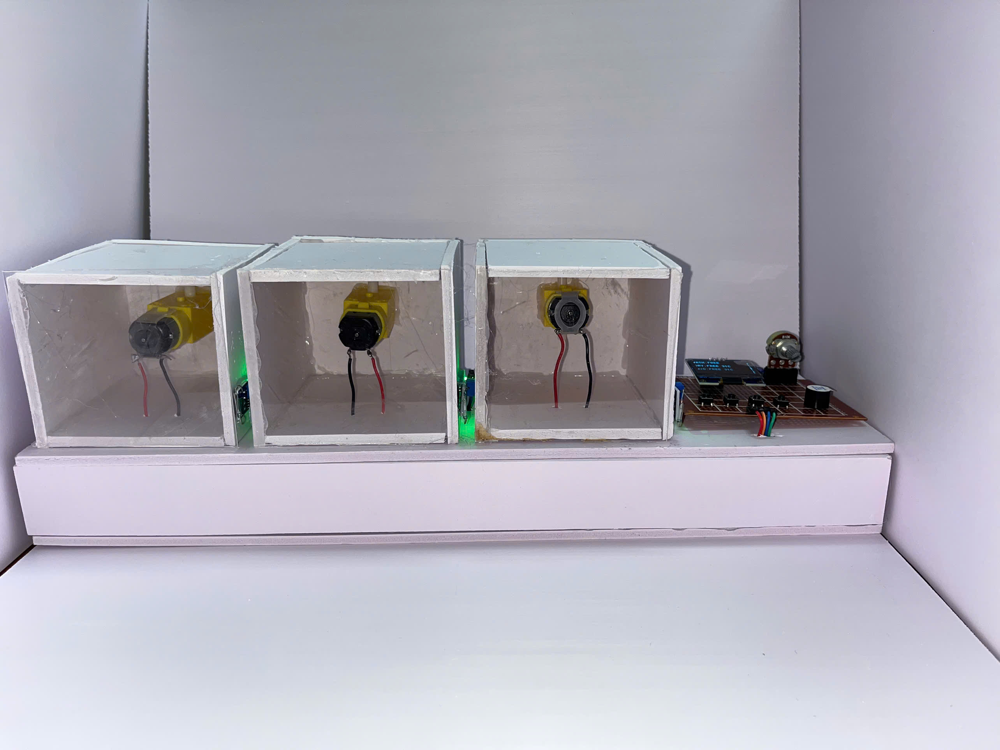
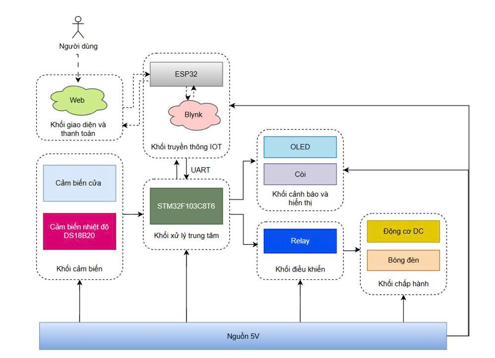
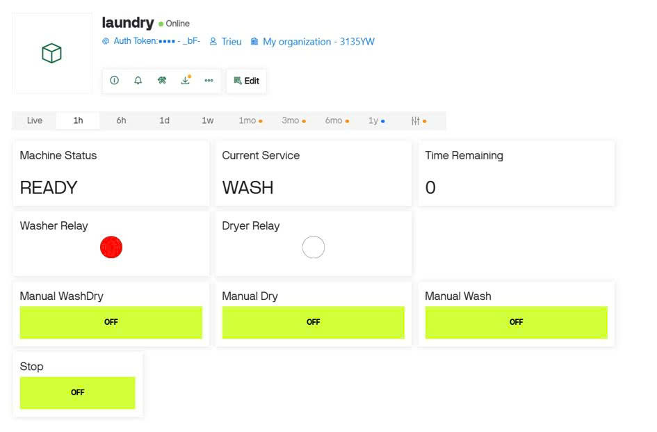

# IoT Self-Service Laundry System (IoT & FinTech Integration)

[](https://github.com)
[](https://github)
[](LICENSE)

An end-to-end IoT-enabled self-service laundry prototype that integrates an **Embedded Control System**, **IoT Cloud Communication**, and an **Online Payment Gateway (VietQR via payOS)** to automate unmanned laundry operations.

---

<p align="center">
  
  <br>
  <em>Figure 1: Completed hardware prototype of the IoT Self-Service Laundry System</em>
</p>
---

## Description

Traditional self-service laundry shops often rely on physical token dispensers, coins, or specialized magnetic cards, which require constant maintenance, cash handling, and on-site staff. 

**IoT Self-Service Laundry System** bridges this gap by modernizing the entire workflow through a contactless, cloud-managed infrastructure. 
- **The User's Journey:** A user simply scans a QR code on the machine, which opens a sleek Web App to select a service (Wash, Dry, or Wash & Dry). They pay instantly via VietQR.
- **The System's Reaction:** The backend server validates the payment in real-time through Webhooks and triggers the hardware via the Blynk IoT Cloud.
- **The Hardware's Execution:** A dual-microcontroller architecture (STM32 & ESP32) coordinates the physical washing/drying components safely, monitoring system parameters (temperature, door latch) in real-time to guarantee user safety and process efficiency.

This project serves as a highly practical, scalable prototype demonstrating how modern Web, Fintech, and Embedded systems can converge to solve real-world automation challenges.

---

## Key Features

- **Automated QR Code Payment**: Integrated with the **payOS (VietQR)** gateway. Real-time payment verification via Webhooks automatically activates the machine upon successful transaction.
- **Cloud-Based Remote Monitoring (IoT)**: Employs **Blynk IoT Cloud** as the communication bridge between the Web Server and the physical hardware.
- **Dual-MCU Real-Time Architecture**:
  - **ESP32** handles wireless communication (Wi-Fi, Blynk Client, and UART routing).
  - **STM32F103C8T6** serves as the central controller executing real-time hardware tasks, sensor reading, and safety interrupts.
- **Smart Safety Mechanisms**:
  - Automatically halts operation and triggers an audible buzzer alarm if the door is opened unexpectedly or if the dryer drum temperature exceeds the safety threshold ($> 60^\circ\text{C}$).
- **Time-Saving Testing Mode (Speed Factor)**: Utilizes a 12-bit ADC potentiometer to adjust a `SpeedFactor` (ranging from 1x to 20x), allowing developers to compress a real-world multi-minute cycle into seconds for rapid demo/testing.
- **Local Control Mode**: A fallback physical interface featuring tactile navigation buttons (UP, DOWN, OK, POWER) and an OLED display, allowing manual operation if internet connectivity is lost.

---

## System Architecture

The system operates on a 4-layer decoupled architecture:

```text
  [ User Client: Web App (React + Vite) ] 
                     │ 
                     ▼ (Create Transaction / Polling Status)
     [ Backend Server: Node.js + Express ] ──(Webhook)──► [ payOS API (VietQR) ]
                     │
                     ▼ (Blynk API Update V0 Pin)
              [ Blynk Cloud ]
                     │
                     ▼ (Wi-Fi)
              [ ESP32 GateWay ]
                     │
                     ▼ (UART Communication)
    [ STM32F103C8T6 (Main Controller) ]
      ├── Inputs: Door Magnetic Sensor, DS18B20 Temp Sensor, ADC Potentiometer, Buttons
      └── Outputs: 4-Channel Relay Module (Motors, Heating Lamp), OLED Display, Buzzer
```
---

<p align="center">
  
  <br>
  <em style="color: #666; font-size: 0.9em;">Figure 2: System Block Diagram representing the connection between ESP32, STM32, Sensors, and Actuators</em>
</p>

---

## Web Client Interface

<p align="center">
  
  <br>
  <em style="color: #666; font-size: 0.9em;">Figure 3: Web-based service selection and payment interface (React & payOS)</em>
</p>

---

## Blynk IoT Dashboard
<p align="center">
  
  <br>
  <em style="color: #666; font-size: 0.9em;">Figure 4: Blynk IoT Dashboard layout for remote monitoring and state management</em>
</p>
